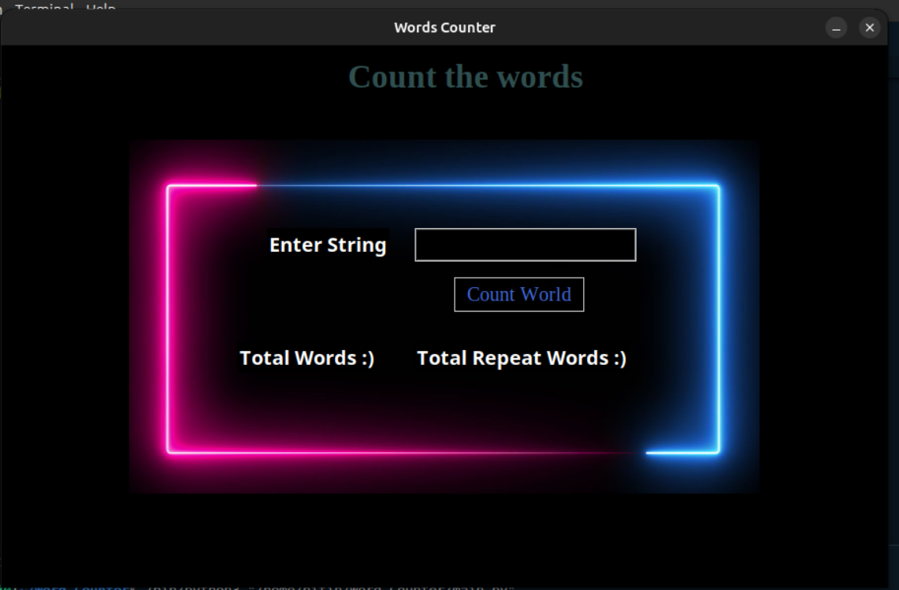

# Word Counter Application

This is a simple word counter application built using Python's Tkinter library. The application allows users to input a string of text and counts the total number of words in the input as well as the total number of unique words.

## Features

- Input field to enter the string of text.
- Button to initiate the word count.
- Displays total words in the input.
- Displays total unique words in the input.

## GUI Overview

The GUI (Graphical User Interface) of the application consists of the following elements:

- **Title**: "Count the words" displayed at the top center of the window with varying colors.
- **Input Field**: An entry field labeled "Enter String" where users can input their text.
- **Count Button**: A button labeled "Count Words" to initiate the word counting process.
- **Total Words**: Text label indicating the total number of words in the input.
- **Total Unique Words**: Text label indicating the total number of unique words in the input.

## How it Works

1. Enter a string of text into the "Enter String" input field.
2. Click on the "Count Words" button.
3. The application will then process the input string, counting the total number of words and the total number of unique words.
4. The results are displayed in the respective text labels below the input field.
5. You can repeat the process by entering a new string of text and clicking the button again.

## Implementation Details

- The application uses Tkinter for building the GUI.
- It utilizes the `StringVar()` to store the input string.
- The `check_string()` method is called when the button is clicked to count the words.
- The input string is split into words using spaces as delimiters.
- The total number of words and the total number of unique words are calculated and displayed on the GUI.

## Dependencies

- Tkinter: Python's standard GUI (Graphical User Interface) package.
- PIL (Python Imaging Library): Used for working with images. In this case, for displaying a background image.

---

